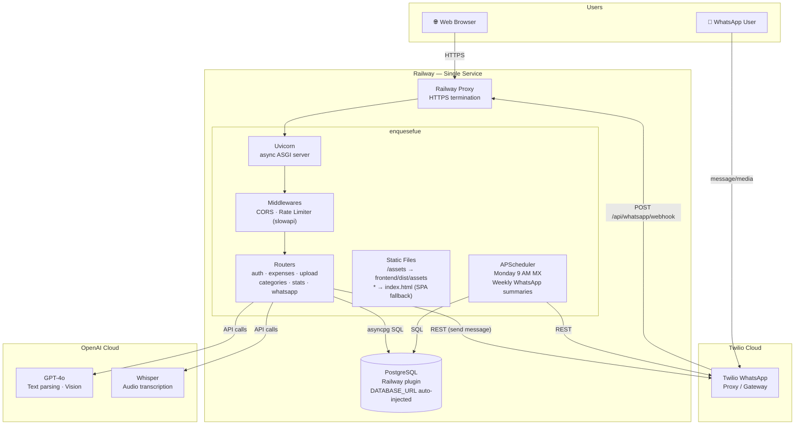
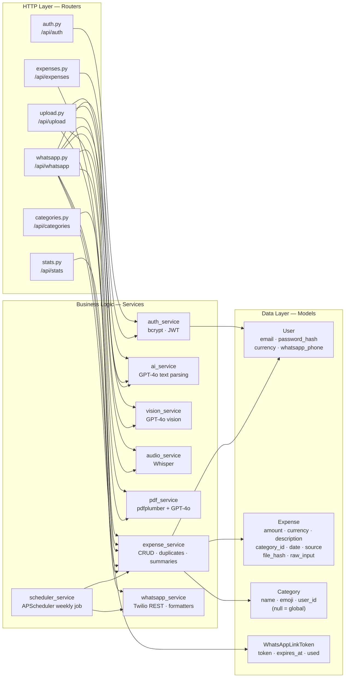
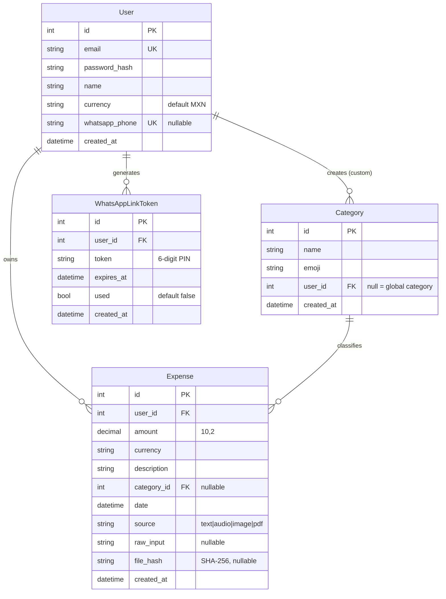
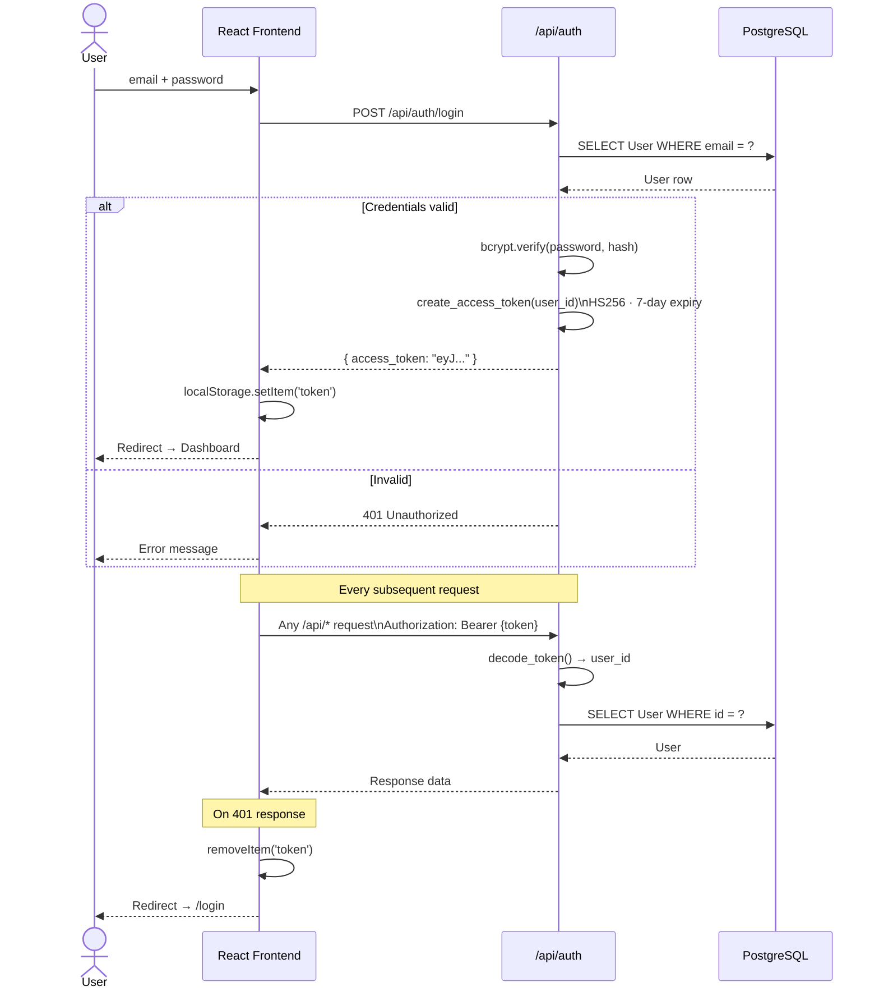
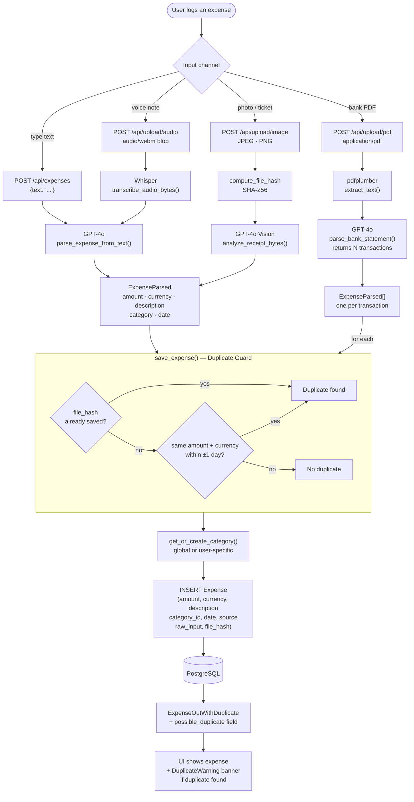
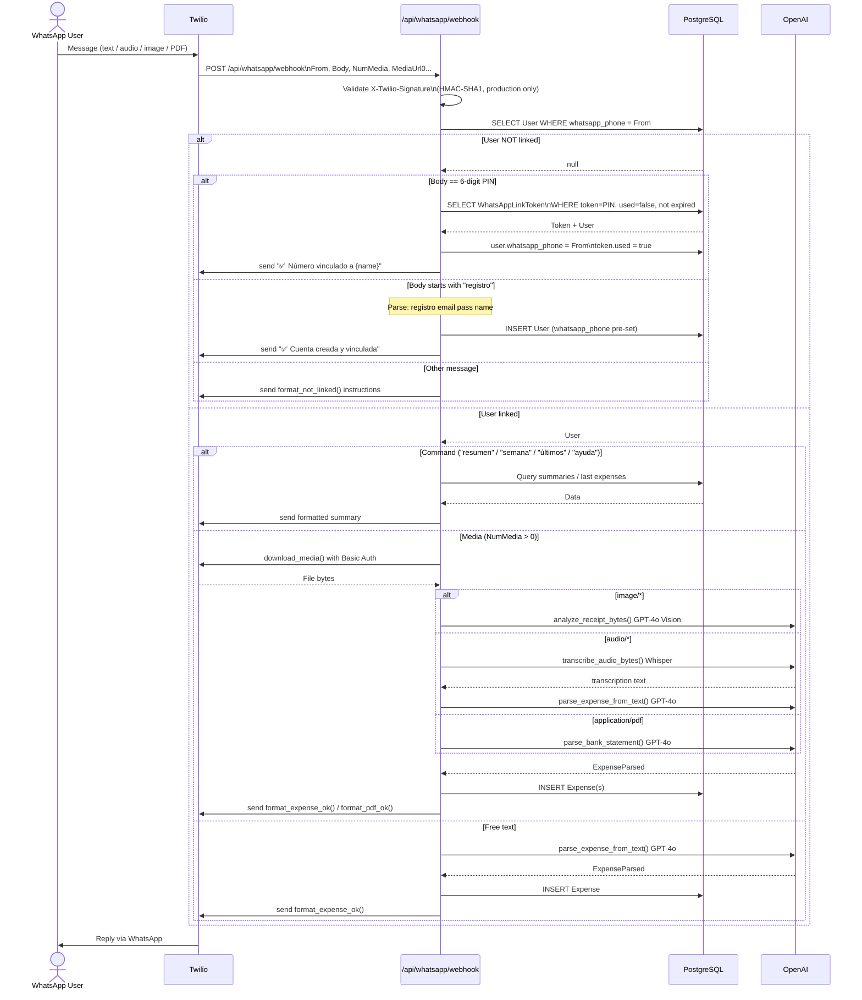
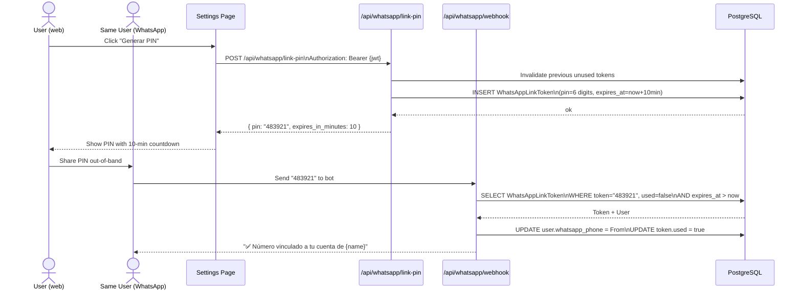
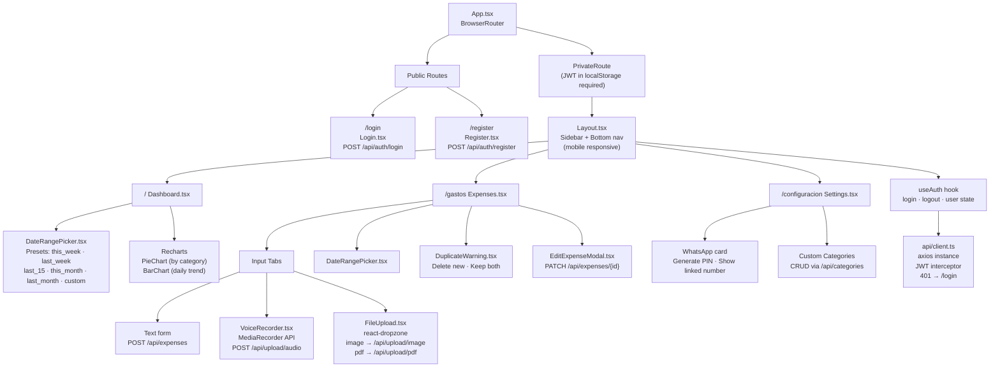

# ¿En qué se me fue? — Architecture

---

## 1. System Overview

---

## 2. Backend Layer Structure

---

## 3. Data Model (ER Diagram)

---

## 4. Authentication Flow

---

## 5. Expense Ingestion Flow

---

## 6. WhatsApp Message Flow

---

## 7. WhatsApp Account Linking (PIN Flow)

---

## 8. Frontend Structure

---

## 9. API Rate Limits

| Endpoint | Limit | Reason |
|---|---|---|
| `POST /api/auth/register` | 30/min | Account creation |
| `POST /api/auth/login` | 1/min | Brute-force protection |
| `POST /api/expenses` | 1/min | GPT-4o text call |
| `POST /api/upload/image` | 1/min | GPT-4o Vision call |
| `POST /api/upload/audio` | 1/min | Whisper + GPT-4o |
| `POST /api/upload/pdf` | 1/min | pdfplumber + GPT-4o |
| `POST /api/whatsapp/webhook` | 1/min | Twilio calls |
| `POST /api/whatsapp/link-pin` | 1/min | PIN generation |
| All `GET` endpoints | unlimited | Cheap DB reads, JWT-protected |

Rate limits are IP-based (reads `X-Forwarded-For` for correct IP behind Railway's proxy).

---

## 10. Expense Source Types

| Source | Input | AI Model | Route |
|---|---|---|---|
| `text` | Free text ("gasté 150 en el súper") | GPT-4o | `POST /api/expenses` |
| `audio` | Voice note (webm/ogg/mp3) | Whisper → GPT-4o | `POST /api/upload/audio` |
| `image` | Ticket photo (JPEG/PNG) | GPT-4o Vision | `POST /api/upload/image` |
| `pdf` | Bank statement PDF | pdfplumber → GPT-4o | `POST /api/upload/pdf` |
| `text` | WhatsApp text message | GPT-4o | `POST /api/whatsapp/webhook` |
| `audio` | WhatsApp voice note (ogg) | Whisper → GPT-4o | `POST /api/whatsapp/webhook` |
| `image` | WhatsApp photo | GPT-4o Vision | `POST /api/whatsapp/webhook` |
| `pdf` | WhatsApp PDF | pdfplumber → GPT-4o | `POST /api/whatsapp/webhook` |
